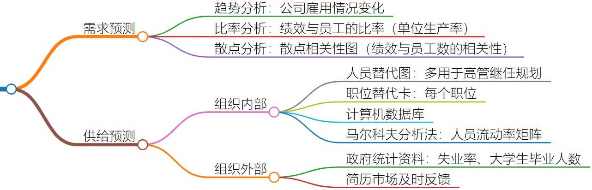
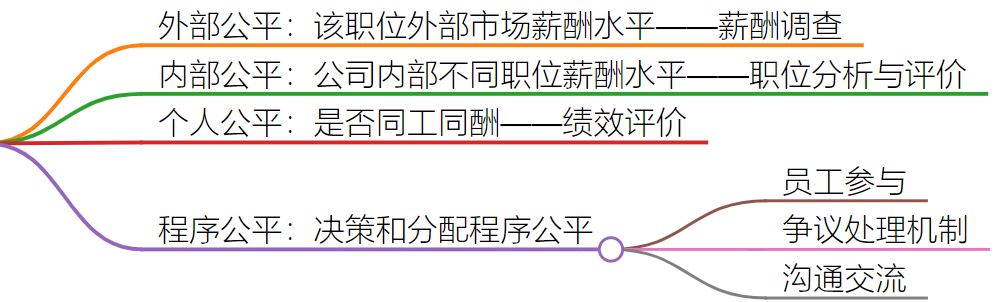

<!-- @import "[TOC]" {cmd="toc" depthFrom=1 depthTo=6 orderedList=false} -->

<!-- code_chunk_output -->

- [人力资源管理笔记](#人力资源管理笔记)
  - [基本核心定义](#基本核心定义)
    - [战略管理八步骤](#战略管理八步骤)
  - [什么是人力资源管理](#什么是人力资源管理)
    - [人力资源管理定义](#人力资源管理定义)
    - [人力资源主题](#人力资源主题)
    - [为什么HRM对所有管理者都有用](#为什么hrm对所有管理者都有用)
  - [职位分析与人才管理过程](#职位分析与人才管理过程)
    - [职位分析](#职位分析)
  - [人事规划](#人事规划)
  - [招募、甄选与配置](#招募甄选与配置)
    - [内部遴选](#内部遴选)
    - [外部招募](#外部招募)
    - [员工测试与甄选](#员工测试与甄选)
    - [面试](#面试)
  - [培训与开发](#培训与开发)
    - [培训流程](#培训流程)
  - [绩效管理](#绩效管理)
    - [绩效管理流程](#绩效管理流程)
    - [绩效评价技术](#绩效评价技术)
    - [绩效面谈](#绩效面谈)
  - [员工职业生涯管理](#员工职业生涯管理)
    - [员工离职与员工保留](#员工离职与员工保留)
    - [职业生涯管理](#职业生涯管理)
    - [解雇员工](#解雇员工)
  - [薪酬管理](#薪酬管理)
    - [绩效薪酬和经济型奖励](#绩效薪酬和经济型奖励)
      - [激励理论](#激励理论)
      - [薪酬设计](#薪酬设计)
      - [组织绩效奖励（可变薪酬）](#组织绩效奖励可变薪酬)
    - [福利与服务](#福利与服务)
  - [一些表格](#一些表格)

<!-- /code_chunk_output -->
## 人力资源管理笔记
### 基本核心定义
- 组织：一群有明确的角色分工，并且为了实现组织的共同目标而在一起工作的人组成的社会实体
- 管理者：通过对组织内所有人的活动加以管理来确保组织目标实现的人
- 管理过程：计划、组织、人事（HRM）、领导、控制

- 反歧视（显性的和无意识的）：种族、性别（含怀孕和生育)、年龄、残障、国籍等，公平就业&公平薪酬
- 员工多元化威胁：
    - 刻板印象stereotype
	- 歧视（显性和隐性）
	- 形式主义
	- 种族中心主义
	- 性别角色刻板印象
- 逆向歧视：在保障特定群体受到公平待遇之后，之前优势的群体反而受到了新的歧视或不公平待遇-（矫枉过正）
- 人力资本：知识、正规教育、培训、技能及经验等
- 人才管理：人才获取——培训/开发——人才保留 

#### 战略管理八步骤

- 战略规划：使公司内部S/W与公司外部O/T相匹配
- 战略类型
  - 公司层：集中化（单一业务）、多元化、纵向一体化（全产业链条）、横向一体化（并购、联盟）、地理扩张、收缩战略等
  - 业务单元：竞争优势
    - 成本
    - 差异化
    - 细分市场（聚焦） 
  - 职能部门：具体执行策略

### 什么是人力资源管理
#### 人力资源管理定义
- 是一个获取、培训、评价员工以及向员工支付薪酬的管理过程；
- 也是一个关注劳资关系、员工健康安全以及公平等方面问题的管理过程
#### 人力资源主题

#### 为什么HRM对所有管理者都有用
- 直线职权（直线经理）：上下级命令
- 职能职权（HRM、法务等）：咨询性、支持性

### 职位分析与人才管理过程
#### 职位分析

- 职位分析方法
  - 结构化访谈法
  - 问卷法
  - 工作日志法
### 人事规划
- 规划撰写
  - 需求预测
  - 组织内部和外部供给预测
  - 人员培训、开发及晋升计划
  - 实施此规划所需的各种资源及成本分析（含面试费用）

### 招募、甄选与配置
#### 内部遴选

#### 外部招募
- 互联网、广告、校园招聘与实习、猎头公司、内推与自荐
- 临时工与项目外包
- 离岸经营与职位外包（劳动/劳务合同为第三方）
- 远程办公/居家办公

#### 员工测试与甄选
- 候选人与职位的匹配度
- 候选人与组织团队的匹配度

- 员工测试效用分析
  - 测试工具的效度
  - 校标统计
  - 平均测试分数
  - 平均测试成本
  - 参加测试与录取比
- 测试类型

#### 面试
- 面试阶段
  - 招募甄选面试
  - 绩效评价面谈
  - 解雇和离职面谈
- 面试类型
  - 结构化面试
  - 非结构化面试

- 结构化面试问题设计
  - 情境性问题
  - 行为性问题（STAR）
  - 工作知识
  - 意愿性问题
> #### 求职者面试指南
> 
### 培训与开发
- 新员工入职引导手册/清单（onboarding）
#### 培训流程

### 绩效管理
#### 绩效管理流程

#### 绩效评价技术

- 绩效评价误差

#### 绩效面谈
- 优秀可晋升：职业发展规划，并制定具体开发计划
- 优秀但无晋升缺空：加强激励促使其保持优秀
- 不优秀但可改善：制定培训计划帮助改进
- 不优秀且不可改善：劝退
- 绩效面谈要点
  - 基于客观工作绩效数据和事实
  - 鼓励员工多讲话，认真倾听其意见使其充分表达
  - 不要伤及自尊
  - 面谈结果应达成一致
- 绩效积极管理：绩效评价水平x组织价值（核心度）矩阵，以实行人才转化（外包转正）、开发（核心度提升）或淘汰计划
### 员工职业生涯管理
#### 员工离职与员工保留
- 离职成本
  - 有形成本：招募、甄选、面试、测试，上岗引导及培训，在岗期间的工资成本等
  - 无形成本：生产率损失、纠错成本、监督成本
- 自愿离职因素

- 综合保留手段

#### 职业生涯管理
- 职业生涯：一个人在多年中担任的各种职位的集合
- CM（管理）：让员工更好了解和开发自己的职业技能和兴趣
- CD（开发）：进行职业探索、职业确立、取得职业成就、获得职业满足等一系列连续活动
- CP（规划）：
  - 认知自己的KSAO等特征和动机
  - 获得各种关于机会和选择的信息，确定与职业相关的目标
  - 制定行动计划来实现这些目标
- 现实震荡reality shock：满怀期待、满怀工作热情的新员工面对枯燥而缺乏挑战性的工作。
#### 解雇员工
- 解雇类型
  - 绩效不达标：缺勤、迟到、持续不达标或工作态度太差
  - 行为不端：故意和蓄意违反企业规定，不服从，偷窃财务，行为粗暴等
  - 达不到任职资格：经过培训仍无法胜任，可调岗或辞退
  - 职位任职资格便获或职位撤销：调岗或辞退
- 解雇注意事项
  - 制定正式的含多个步骤的解雇程序及申诉程序
  - 相对人道地告知员工解雇决定
  - 允许员工自我解释和辩护，并向员工充分解释解雇决策
  - 解雇遣散费
- 解雇面谈
  - 解雇面谈规划

  - 直奔主题
  - 用数据和具体行为记录描述情况
  - 倾听被解雇方陈述
  - 审查遣散费等条款
  - 告知离职流程
### 薪酬管理
- 员工薪酬
  - 直接经济报酬：工资、薪金、奖金、佣金、红利等
  - 间接经济报酬：保险、带薪休假等福利
- 薪酬公平

#### 绩效薪酬和经济型奖励
##### 激励理论

##### 薪酬设计

- 翘尾效应：前一阶段销售额会有一定延续性，并不一定真实反映销售团队的实际努力情况。
- 金手铐：通过长期激励计划使员工利益与公司利益牢牢绑定
- 金色降落伞：公司改变所有权或控制权时，对员工（特别是高管）给予一次性补偿
##### 组织绩效奖励（可变薪酬）

#### 福利与服务

******
### 一些表格
| 新员工 | 现任员工 | 员工离职 |
| :-----: | :----: | :----: |
| 求职申请表（含简历）|员工身份信息记录表及变更申请表|退休人员手续清单|
|入职清单|绩效评价表与培训开发记录|解雇与离职手续清单|
|面试表|休假申请表|失业声明|
|背景调查表 |职位描述|员工离职面谈记录|
|雇佣合同及员工保密协议|缺勤记录表|
|试用期评估表|奖惩日志及申诉表|
||费用报告（销）表|
||工资单|
||工伤报告|
